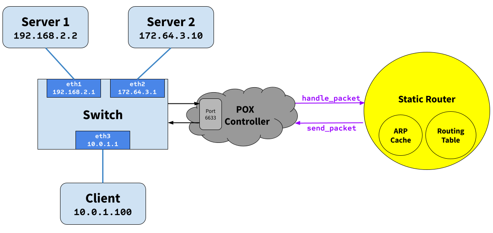

# Assignment 4: Designing a Static Router

### Due: December 6th, 2024 at 11:59 PM

## Overview

In this assignment, you will be writing a simple router configured with a static routing table. Your router will receive raw Ethernet frames. It will process the packets just like a real router, then forward them to the correct outgoing interface.

Your task is to implement the forwarding logic so packets go to the correct interface.

This is not a simulation: your router *will* route real packets to HTTP servers sitting behind your router. When you have finished your router, you should be able to access these servers using regular client software (e.g., `wget/curl`). In addition, you should be able to `ping` and `traceroute` to and through a functioning Internet router. This is the topology you will be using for your development:



* The yellow parts (i.e. the static router, including implementations of the ARPCache and the RoutingTable classes) is the part that you will be writing. Your static router will control the logic of the Mininet switch. 
* The blue parts are the topology implemented within Mininet, which includes a switch and three hosts (server1, server2, and the client). 
* The POX controller just eases communication between Mininet and your code; you don't need to think about how it works. 

**NOTE: From this point in the spec, we use *router* to refer to the static router that you will be writing, and *switch* to refer to the Mininet switch.** 

> In general, the terms switch and router are used somewhat confusingly in a networking context. There is a [technical difference between them](https://www.cloudflare.com/learning/network-layer/what-is-a-network-switch/), but modern consumer routers often have built-in switches, so you will hear the two terms used interchangably outside this project.


Once your router is functioning correctly, you will be able to perform all of the following operations:

* Ping any of the switch's interfaces from the hosts.
* Traceroute to any of the switch's interface IP addresses.
* Ping any of the hosts from any other host.
* Traceroute to any of the hosts from any other host.
* Download a file using HTTP from one of the HTTP servers.

Additional requirements are laid out in the "Requirements" section.

* [Getting Started](#getting-started)
* [Background](#background)
* [Code Overview](#code-overview)
* [Debugging](#debugging)
* [Submitting](#submitting)
* [Important Notes](#important-notes)
* [FAQ](#faq)

## Learning Outcomes

After completing this programming assignment, students should be able to:

* Describe how routers work.
* Explain how layer 2 and 3 protocols such as ARP and ICMP work.

<a name="getting-started"></a>
## Getting Set Up

### Prerequisites
For this assignment, you can write all of your code locally (although we will still be using a remote machine to run Mininet and forward the traffic to your local computer). **This is the preferred option.**

You can also choose to develop on the provided AWS image. 

#### AWS Setup (For Everyone)
You will find an AMI named something like "489 P4" in your AWS account associated with this class, accessed through AWS Learner Lab. Please create a new EC2 instance using this AMI, similar to what you did in Projects 1 and 2. You can find the Project 1 AWS setup guide [here](aws-setup-p1.pdf) for convenience. 

Your instance type does not have to be particularly beefy; a `t2.medium` works perfectly fine, and even smaller will probably work as well. 

Once you have this EC2 instance set up, please clone this repository within the machine.

#### Local Setup (If Developing Locally)

If you're developing on the provided AWS image, you can skip to "Setting Up the Starter Code".

If you choose to develop locally, you must have CMake, Boost, and Protocol Buffers installed.

If you are on a Mac, this is very easy. Simply use Homebrew and run
```bash
brew install cmake boost protobuf
```
and you're done and ready to skip to "Setting Up the Starter Code".

On Windows or Linux, installing CMake and Boost are also relatively simple. On Ubuntu / WSL, you can run
```bash
sudo apt-get install cmake libboost-all-dev
```
However, for Protocol Buffers, you will need to build it from source. The following instructions will guide you through the process.

First, run the following command to clone the Protocol Buffers repository:
```bash
git clone https://github.com/protocolbuffers/protobuf.git
```

Then, `cd` into the repository by running:
```bash
cd protobuf
```

Next, check out a release version of Protocol Buffers by running:
```bash
git checkout tags/v28.3
```

Then, run the following commands in succession to build and install Protocol Buffers:
```bash
$ git submodule update --init --recursive
$ mkdir cmake/build
$ cd cmake/build
$ cmake -Dprotobuf_BUILD_TESTS=OFF ../..
$ make -j 8
$ sudo make install
```

It may take a while to build Protocol Buffers after running the `make` command. Once it is done, you should be able to run `protoc --version` and see the version of Protocol Buffers you just installed.

**Note:** The above command will install Protocol Buffers globally on your system, making it difficult to uninstall. If you want to install it locally, you can run `cmake` with the `-DCMAKE_INSTALL_PREFIX` flag, and set the corresponding `-DProtobuf_DIR` flag when building the starter code or [use a CMake preset with cache variables](https://mcuoneclipse.com/2023/12/03/building-with-cmake-presets/) when building your project. 

Finally, make sure you have `venv` installed (it is usually pre-installed on most Python distributions). If not, use Google to find out how to install it for your specific OS.

### Setting Up the Starter Code 
This section should be completed wherever you are planning on developing, whether locally or on AWS. 

First, download the starter code by cloning this repository. Then, run `setup.sh` to set up the environment. This script will create the Protocol Buffers files and create a virtual environment for Python that other scripts will use.

### Running the Starter Code

The provided code contains three parts:
#### Static Router

This is the only part of the code that you will be writing. It is a simple router that forwards packets based on a static routing table. More on this later.

#### POX Controller

The POX controller allows the Mininet switch to communicate with the router. The flow-chart of communication looks like this:

```aiignore
Mininet Host --> Mininet Switch: "Hey, I have this packet for you."
Mininet Switch --> POX Controller: "Hey, this packet just came in, what should I do with it?"
POX Controller --> Your Router: "Hey, this packet just came in. Let me know if I should send out any packets soon, and if so, out of which interface."
Your Router --> POX Controller: "Send out this packet out of this interface."
POX Controller --> Mininet Switch: "Send out this packet out of this interface."
Mininet Switch --> Another Mininet Host: "I have this packet for you."
```

#### Mininet Topology

The Mininet topology is a simple network with three hosts and a switch. The hosts are `client`, `server1`, and `server2`. The switch is a simple switch that forwards packets out of the given interface.

## The Router

### Understanding a Routing Table File
Each line in the routing table (rtable) file is a routing entry and has the following format:

```
prefix        next_hop     netmask          interface
```

Here is the default routing table that you will find on the VM. The first entry is the default route.

```
0.0.0.0       10.0.1.100   0.0.0.0          eth3
192.168.2.2   192.168.2.2  255.255.255.255  eth1
172.64.3.10   172.64.3.10  255.255.255.255  eth2
```
Note that your code should be able to handle any valid routing table, as we will test it with different topologies on the autograder. 

### Building and Running
You should now have all the pieces needed to build and run the router:

* A routing table file that corresponds to the routing table for the router node in that topology
* The starter code

You first want to ssh into the AWS remote host, forwarding the port for Mininet if running locally. You can do this by running the following command:

**If you are running the server and POX locally:**
```bash
$ ssh -i <your-key.pem> -R 6633:localhost:6633 ubuntu@<your-aws-ip>
```

**If you are running the server and POX on the AWS remote host:**
```bash
$ ssh -i <your-key.pem> ubuntu@<your-aws-ip>
```

> 6633 is the default port used by POX for communication. Do not try to use a different port; this is not an arbitrary choice. 

You can build and run the starter code as follows:

```bash
$ mkdir build
$ cd build
$ cmake ..
$ make
```
First, run POX wherever you are developing your code:
```bash
$ ./run_pox.sh
```

**On the AWS remote host**, run the following command:
```bash
$ ./run_mininet.sh
````

Mininet and POX need to be started for your router to run.

> Note: Mininet will connect to POX, so POX should be running first. However, it is okay if you need to restart POX while Mininet is running, as long as there is not a large amount of time where Mininet is running but POX is not.*

Now, you can run the router (again, wherever you are developing your code):
```bash
$ ./StaticRouter -r ../rtable
```

By default, SR looks for `rtable` from the current working directory. This can be overridden by the `-r` option.

In summary, always run Mininet on AWS:
- If you are developing on AWS, run POX and StaticRouter on AWS as well.
- If you are developing locally, set up reverse port forwarding for Port 6633 (with the command provided above). Run POX and StaticRouter locally. 

<a name="background"></a>
## Background: Routing
> The term "router" in this section refers to both the Mininet switch and your router, as your router is an implementation detail of the switch to any Mininet hosts that interact with the switch. 

This section has an outline of the forwarding logic for a router, although it does not contain all the details. There are two main parts to this assignment: IP forwarding and handling ARP.

When an IP packet arrives at the router, it arrives inside an Ethernet frame. Your router needs to check if it is the final destination of the packet, and if not, forward it along the correct link based on its forwarding table. The forwarding table names the IP address of the next hop. The router must use ARP to learn the Ethernet address of the next hop IP address, so it can address the Ethernet frame correctly.

### A Note on IP Addresses
Every interface on the Mininet switch (`eth1`, `eth2`, `eth3`) has an individual IP address along with the hosts (`client`, `server1`, `server2`). Having a separate IP for every interface on a L3 switch is common practice, as it helps route traffic between different networks correctly. In a real situation, the L3 switch would probably have each interface connect to a  subnetwork -- in this case, we simplify this by just having each interface point to a different host. 

Each interface is generally assigned an IP address from the subnet it is connected to (you may have noticed that the IP address for each interface is similar to the IP address of the host it is connected to). This is because for devices within a subnet to communicate directly with another device, they need to have a **matching subnet mask**, which identifies which IP addresses are **local** (within the subnet) and which are **remote** (outside the subnet). This allows the L3 router to be considered the default gateway for devices within the subnet to communicate with the outside world. 

### IP Forwarding and ARPs
Given a raw Ethernet frame, if the frame contains an IP packet whose destination is not one of the router's interfaces:

1. Check that the packet is valid (has a correct checksum).
2. Decrement the TTL by 1, and recompute the packet checksum over the modified header.
3. Find out which entry in the routing table has the longest prefix match with the destination IP address.
4. Check the ARP cache for the next-hop MAC address corresponding to the next-hop IP. If it's there, send it. Otherwise, send an ARP request for the next-hop IP (if one hasn't been sent within the last second), and add the packet to the queue of packets waiting on this ARP request.

This is a high-level overview of the forwarding process. More low-level details are below. For example, if an error occurs in any of the above steps, you will have to send an ICMP message back to the sender notifying them of an error. You may also get an ARP request or reply, which has to interact with the ARP cache correctly.

### Protocols to Understand

#### Ethernet
You are given a raw Ethernet frame and have to send raw Ethernet frames. You should understand source and destination MAC addresses and the idea that we forward a packet one hop by changing the destination MAC address of the forwarded packet to the MAC address of the next hop's incoming interface.

#### Internet Protocol
Before operating on an IP packet, you should verify its checksum. Packets with checksum mismatch are discarded. You should understand how to find the longest prefix match of a destination IP address in the routing table described in the [Getting Started](#getting-started) section. If you determine that a datagram should be forwarded, you should correctly decrement the TTL field of the header and recompute the checksum over the changed header before forwarding it to the next hop.

#### Internet Control Message Protocol
ICMP sends control information. In this assignment, your router will use ICMP to send messages back to a sending host. You will need to properly generate the following ICMP messages (including the ICMP header checksum) in response to the sending host under the following conditions:

* **Echo reply (type 0):** Sent in response to an echo request (`ping`) to one of the router's interfaces. (This is only for echo requests to any of the router's IPs. An echo request sent elsewhere should be forwarded).
* **Destination net unreachable (type 3, code 0):** Sent if there is a non-existent route to the destination IP (no matching entry in routing table when forwarding an IP packet).
* **Destination host unreachable (type 3, code 1):** Sent after seven ARP requests were sent to the next-hop IP without a response.
* **Port unreachable (type 3, code 3):** Sent if an IP packet containing a UDP or TCP payload is sent to one of the router's interfaces. This is needed for `traceroute` to work.
* **Time exceeded (type 11, code 0):** Sent if an IP packet is discarded during processing because the TTL field is 0. This is also needed for `traceroute` to work.

Some ICMP messages may come from the source address of any of the router interfaces, while others must come from a specific interface. Please refer to [RFC 792](https://tools.ietf.org/html/rfc792) for details. As mentioned above, the only incoming ICMP message destined towards the router's IPs that you have to explicitly process are ICMP echo requests. You may want to create additional structs for ICMP messages for convenience, but make sure to use the `packed` attribute so that the compiler doesn't try to align the fields in the struct to word boundaries. To learn more, feel free to look at [GCC Type Attributes](https://gcc.gnu.org/onlinedocs/gcc-3.2/gcc/Type-Attributes.html).

#### Address Resolution Protocol
ARP is needed to determine the next-hop MAC address that corresponds to the next-hop IP address stored in the routing table. Without the ability to generate an ARP request and process ARP replies, your router would not be able to fill out the destination MAC address field of the raw Ethernet frame you are sending over the outgoing interface. Analogously, without the ability to process ARP requests and generate ARP replies, no other router could send your router Ethernet frames. Therefore, your router must generate and process ARP requests and replies.

To lessen the number of ARP requests sent out, you are required to cache ARP replies. Cache entries should time out after a given amount of time to minimize staleness. The provided ARP cache class already times the entries out for you.

When forwarding a packet to a next-hop IP address, the router should first check the ARP cache for the corresponding MAC address before sending an ARP request. In the case of a cache miss, an ARP request should be sent to a target IP address about once every second until a reply comes in. If the ARP request is sent seven times with no reply, an ICMP destination host unreachable is sent back to the source IP as stated above. The provided ARP request queue will help you manage the request queue.

In the case of an ARP request, you should only send an ARP reply if the target IP address is one of your router's IP addresses.

Note: ARP requests are sent to the broadcast MAC address (`ff-ff-ff-ff-ff-ff`). ARP replies are sent directly to the requester's MAC address.

#### IP Packet Destinations
An incoming IP packet may be destined for one of your router's IP addresses, or it may be destined elsewhere. If it is sent to one of your router's IP addresses, you should take the following actions, consistent with the section on protocols above:

* If the packet is an ICMP echo request and its checksum is valid, send an ICMP echo reply to the sending host.
* If the packet contains a TCP or UDP payload, send an ICMP port unreachable to the sending host.
* Otherwise, ignore the packet.

Packets destined elsewhere should be forwarded using your normal forwarding logic.

<a name="code-overview"></a>
## Code Overview

### Classes
**Note:** You can and should modify the provided classes as you need (please don't try to write all your code in the `handlePacket` function for the `StaticRouter`). You are even free to modify/delete all of the starter code.

The only requirements are that:
- The `IPacketSender.h` file is not modified.
- The `IArpCache.h` file is not modified.
- The `IRoutingTable.h` file is not modified.
- The signatures of `StaticRouter`'s constructor and `handlePacket` function are not modified.

You may find it helpful to look at the `IArpCache.h` and `RoutingTable.h` classes to understand the different structures and functions you will be working with.

#### The Router (`StaticRouter.h/cpp`)
You must implement the forwarding logic in `StaticRouter.cpp`. The router is a simple router that forwards packets based on a static routing table. The router will receive raw Ethernet frames and process the packets just like a real router, then forward them to the correct outgoing interface.

The router takes in a class that implements the `PacketSender` interface. This interface exposes a `sendPacket` function that allows you to tell the switch to send a packet out of a specific interface. The router will use this interface to send packets out of an interface.

#### The Routing Table (`RoutingTable.h/cpp`)
You must implement the longest prefix match algorithm in `RoutingTable.cpp`.

The routing table in code is read on from a file (default filename `rtable`, can be set with command line option `-r`). The routing table allows you to look up the information of a interface, and also the next hop IP address and interface for a given destination IP address.

#### The ARP Cache and ARP Request Queue (`ArpCache.h/cpp`)
You must implement most of the functions in `ArpCache.cpp`. The ARP cache is a simple cache that maps IP addresses to MAC addresses. The cache is used to store ARP replies and is used to fill out the destination MAC address of the Ethernet frame when forwarding packets. The cache also times out entries after a given amount of time.

#### Protocol Headers (`protocol.h`)
Within the router framework you will be dealing directly with raw Ethernet packets. The stub code itself provides some data structures in `protocols.h` which you may use to manipulate headers easily. There are a number of resources which describe the protocol headers in detail. RFC Editor provides the specifications of the packet formats you'll be dealing with:

* [Ethernet and ARP](https://www.rfc-editor.org/rfc/rfc826.html)
* [IP](https://www.rfc-editor.org/rfc/rfc791)
* [ICMP](https://www.rfc-editor.org/rfc/rfc792)

<a name="requirements"></a>
## Requirements
In summary, your solution:

1. MUST correctly generate ARP request packets.
2. MUST correctly respond to ARP request packets.
    * It MUST only respond if appropriate.
    * It MUST respond from the proper interface.
    * Responses MUST be unicast.
3. MUST correctly handle ARP response packets by populating the ARP cache.
4. MUST generate the correct ICMP messages for these cases:
    * Receive an ICMP echo request.
    * A received packet's destination has no forwarding table entry.
    * The router cannot determine the link layer address of a packet's next hop. "cannot determine" means there is no ARP entry and 7 consecutive ARP requests fail.
    * A UDP or TCP packet is sent to one of the router's interfaces. This MUST generate an ICMP port unreachable message.
    * A packet's TTL, after being decremented, is 0.
5. The router MUST correctly route packets using IPv4 between the Internet and the application servers.
    * It MAY assume no IP options are used.
    * It MUST correctly validate and generate checksums.
    * It MUST decrement the TTL.
    * It MUST forward packets using the forwarding table, selecting an entry with the longest prefix match algorithm.
    * Note that an Ethernet frame payload may be larger than the encapsulated IP packet. That is, there may be some padding bytes after the IP packet. This can occur when an Ethernet interface tries to align frames on 4-byte boundaries.
6. MUST correctly handle `traceroutes` through it (where it is not the end host) and to it (where it is the end host).
7. MUST maintain an ARP cache whose entries are invalidated after a timeout period (the timeout duration is provided to the ARP Cache when it is created).
8. MUST NOT drop a packet unless there is no matching forwarding table entry, the router cannot determine the next hop link address, or cannot parse the packet.
9. MUST queue all packets waiting for outstanding ARP replies.
10. SHOULD drop a packet waiting for an ARP reply after 7 failed requests for a reply since receiving the packet.

<a name="debugging"></a>
## How to Debug

Because your error might be due to some tiny, low-level mistake, trying to read through pages and pages of output is a waste of time. While logging is of course useful, you will be able to debug your code much faster if you also log packets and use a debugger.

We highly encourage you to take advantage of the fact the project uses CMake. There are various tools for IDEs that make it very easy to compile, run, and debug your code. 
- For Visual Studio Code, you can use the CMake Tools extension to build and debug your code. 
- For CLion, the IDE comes with native support for CMake projects so you can run and debug your code with a single click.

When logging, we encourage you to use `spdlog` to log messages at the correct level. This will allow you to filter out messages that are not relevant to your current debugging task.

Examples of `spdlog` can be found in `utils.cpp`.

### Protocols: Logging Packets
You can log the packets received and generated by your SR program by using the -l parameter. The file will be in `pcap` format, so you can use [Wireshark](https://www.wireshark.org/) or `tcpdump` to read it. Wireshark is free to download, and a powerful tool for a variety of applications -- we encourage you to use this project to become familiar with its basic functionality. 

For example,
```
./StaticRouter -p my_prefix
```
will output `my_prefix_input.pcap` and `my_prefix_output.pcap`.

Besides SR, you can also use Mininet to monitor the traffic that goes in and out of the emulated nodes, i.e., `router`, `server1` and `server2`. Mininet provides direct access to each emulated node. Using server1 as an example, to see the packets in and out of it, go to the Mininet CLI:

```
mininet> server1 sudo tcpdump -n -i server1-eth0
```
### Router
#### Debugging Functions
We have provided you with some basic debugging functions in `utils.h`, `utils.c`. Feel free to use them to print out network header information from your packets. Below are some functions you may find useful:

* `print_hdrs(uint8_t *buf, uint32_t length)`
  Prints out all possible headers starting from the Ethernet header in the packet.
* `print_addr_ip_int(uint32_t ip)`
  Prints out a formatted IP address from a `uint32_t`. Make sure you are passing the IP address in the correct byte ordering.

<a name="submitting"></a>
## Submitting
Submission to the autograder will be done [here](https://g489.eecs.umich.edu/). Submission policy will be announced when the autograder is released, which we anticipate being around halfway through the assignment.

This assignment follows more of a fill-in-the-blank format than the first three, meaning we provide code skeleton that you fill in. Therefore,

The submission may include any files that you have modified or added. However, **you must ensure that:**
- The `IPacketSender.h` file is not modified.
- The `IArpCache.h` file is not modified.
- The `IRoutingTable.h` file is not modified.
- The signatures of `StaticRouter`'s constructor and `handlePacket` function are not modified.

<a name="important-notes"></a>

## Acknowledgements
This programming assignment is based on Stanford's lab 3 from CS 144: Introduction to Computer Networking and translated into C++ by the University of Michigan's EECS 489 F24 staff.
